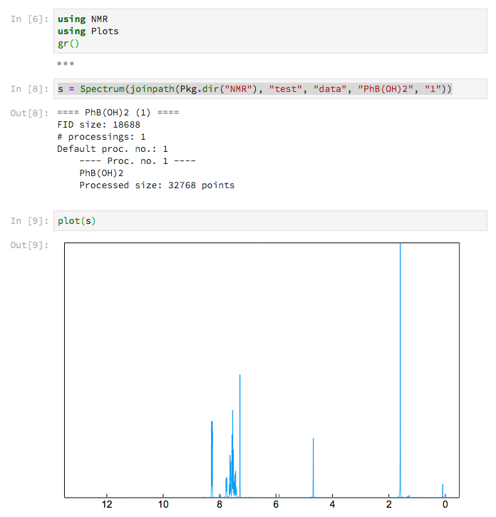

# NMR
A Julia package for processing and visualizing NMR spectra.



## Getting started

NMR.jl has been tested on Julia 0.6 and 0.7. We recommend using the latest stable version of Julia.

### Installation on Julia 0.6
```julia
Pkg.add("NMR")
Pkg.checkout("NMR") # to checkout the latest version

# Alternatively, if you would like to contribute to NMR.jl development:
Pkg.clone("https://github.com/Julia-NMR/NMR.jl")
```
### Installation on Julia 0.7
```julia
# Press ] to switch to Pkg prompt
develop NMR
```

### Usage
Jupyter (`jupyter notebook` or `jupyter lab`) is recommended for exploratory data analysis.
```julia
using NMR
# Example data is included in Bruker format in the test/data folder.
s = Spectrum(joinpath(Pkg.dir("NMR"), "test", "data", "PhB(OH)2", "1"))
s[ (2.3, 1.5) ]   # Data points in the 1.5–2.3 ppm range
plot(s)
```

## Implemented features
* Reading and writing Bruker FIDs and processed data
* Importing of acquisition and processing parameters and integration ranges
* Signal interpolation
* Arithmetic operations between NMR spectra
* Signal integration and integral display
* Utility functions for plotting with
  [Plots.jl](https://github.com/JuliaPlots/Plots.jl)
* Least squares signal decomposition with independent alignment of integration ranges

## TODO
* Peak detection
* Window functions
* Automatic phase correction
* Varian, JEOL, etc. I/O

## Authors
* [S. Hessam M. Mehr](https://hessammehr.github.io) ([github](https://github.com/hessammehr))

## License
MIT

Contributions are very welcome
